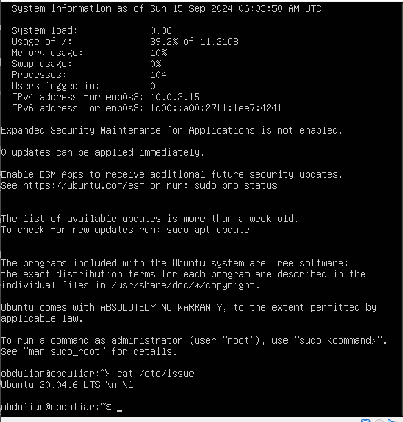

# Part 1. Установка ОС

## Вывод команды cat /etc/issue:


Ввод команды:
```bash
sudo nano /etc/hostname
```
Замена названия в редакторе и сохранение файла.  
Применение изменений:
```bash
sudo hostname "cat /etc/hostname"
```

## Установка часового пояса
Находим название часового пояса:
```bash
timedatectl list-timezones | grep Moscow
```


```bash
Europe/Moscow
```
Устанавливаем часовой пояс:
```bash
sudo timedatectl set-timezone Europe/Moscow
```