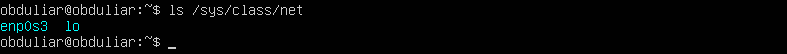
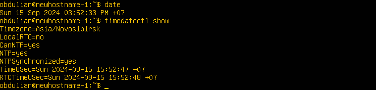
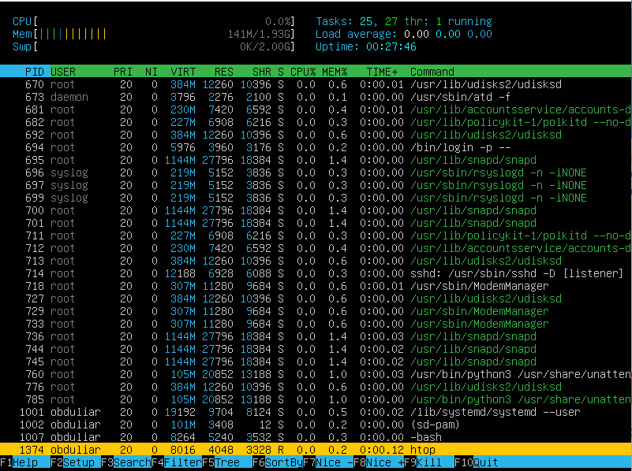
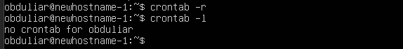

# Part 1. Установка ОС

- Вывод команды `cat /etc/issue`:

# Part 2. Создание профиля

- Вызов команды для создания пользователя:

- Вывод команды `cat /etc/passwd`:

# Part 3. Настройка сети ОС

- Смена названия машины user-1:

- Установка часового пояса:

- Вывод названий сетевых интерфейсов:

enpOs3 - Это сетевой адаптер Ethernet
lo (loopback device) - это виртуальный интерфейс, который служит для подключения по сети к текущей машине. Он есть по умолчанию в Linux. С этим интерфейсом всегда связан адрес 127.0.0.1 и имя localhost.

- Получение ip адреса машины от DHCP сервера:

DHCP — это протокол прикладного уровня, который помогает назначать IP-адреса устройствам при подключении к серверу. Протокол DHCP автоматизирует выдачу адресов, а также их передачу следующим пользователям после отключения устройств или их перехода из одной подсети в другую

- Внешний ip-адрес шлюза (ip) и внутренний IP-адрес шлюза (gw):

`ip = 10.0.2.2`
`gw = 95.104.188.195`

- Статичные настройки ip, gw, dns:
`sudo nano /etc/netplan/00-installer-config.yaml`

- Перезагрузка и проверка ip, gw, dns:
`reboot`

Все изменения настроек после перезагрузки машины остались.

- Перезагрузка и проверка ip, gw, dns:
`reboot`

# Part 4. Обновление ОС

- Команды:
 `sudo apt update`
 `sudo apt upgrade`

- Повторный запуск upgrade:

# Part 5. Использование команды sudo

- Разрешение пользователю, выполнять команду sudo:

- sudo - это утилита, которая позволяет выполнять команды от имени суперпользователя root, либо других пользователей. Правила используемые sudo для принятия решения о предоставлении доступа, находятся в файле /etc/sudoers.

- Изменение hostname ОС от имени пользователя new_obduliar:

- Перезагрузка машины и проверка, что hostname, остался перемеинованным:
 `reboot`

# Part 6. Установка и настройка службы времени

- Время часового пояса, и команда `timedatectl show`:

 Вывод содержит `NTPSynchronized=yes`

# Part 7. Установка и использование текстовых редакторов.

- Так как vim и nano уже установлены на системы, третьим редактором установил Neo Vim:
`sudo apt install neovim`

- Создание файлов в редакторах:
`vim test_vim.txt` Для выхода с сохранением: `esc` + `:wq`

`nano test_nano.txt` Для выхода с сохранением: `ctrl+o` + `enter` + `ctrl+x`

`nvimtest_nvim.txt` Для выхода с сохранением: `esc` + `:wq`

# Part 8. Установка и базовая настройка сервиса SSHD.

- Установка службы SSHD: `sudo apt install openssh-server`
- Установка службы SSHD: `sudo apt install openssh-server`
`sudo apt install neovim`

- Перенастройка службы SSHD на порт 2022:

- Перезапуск ssh:

- Поиск наличия процесса sshd:

Утилита ps предназначена для вывода процессов на экран.
Ключ -e выводит все процессы

- Перезагрузка машины: `reboot`
- Установка `net-tools` для команды `netstat`:

- Вывод команды `netstat -tan` содержит `tcp 0 0 0.0.0.0:2022 0.0.0.0:* LISTEN`:

Ключи:
t - Отображние сокетов только по tcp протоколу.
a - Показывает прослушиваемые и непрослушиваемые сокеты.
n - ОТображение нумерованных адресов вместо именованых (ip и порт вместо dns имен)
Столбцы:
Proto - Протокол (tcp, udp, udpl, raw), оспользуемый сокетом 
Recv-Q - Количество байт, которые не были скопированы пользовательской программой, подключенной к данному сокету.
Send-Q - Количество байт, которые не были распознаны удаленным хостом.
Local Address - Локальный адрес и опрт сокета
Foreign Address - Удаленный адрес и порт сокета.
State - Состояние сокета. Ячейка может быть пустая для RAW, UDP и UDPLite.
начение 0.0.0.0 - прослушиваются все адреса установления соеденения.

# Part 9. Установка и использование утилит top, htop.

- Утилита `top` по умолчанию установлена:

uptime - 7 min
количество авторизованных пользователей - 1
общая загрузка системы - 0% за минуту, 1% за 5 минут, 0% за 15 минут
общее количество процессов - 96
загрузка cpu - 0.0
загрузка памяти 1971.6 total (142.3 used)
режим сортировки входится с помощью комбинации `shift + f`, для сохранения сортировки нужно нажать `s`, для выхода `q`
pid процесса занимающего больше памяти 666 - snapd

pid процесса, занимающего больше всего процессорного времмени  1 - system  

- Использование `htop`:
Сортировка по PID

Сортировка по PERCENT_CPU

Сортировка по PERCENT_MEM

Сортировка по ВРЕМЕНИ

Поиск по sshd

Поиск  syslog

Добавление вывода с hostname, clock, uptime

# Part 10. Использование утилиты fdisk.

- Команда `fdisk -l`:

Данные о жестком диске:
Название:/dev/sda VBOX HARDDISK
Размер: 25 GiB
Количество секторов: 52428800
Размер swap: 2Gib (`swapon -s`)

# Part 11. Использование утилиты df.

- Команда `df /` для корневого раздела в байтах:

Размер раздела: 11758760
Размер занятого пространства: 4884804
Размер свободного пространтства: 6254848
Процент использования: 44

- Команда `df /` для корневого раздела в байтах:

Размер раздела: 12G
Размер занятого пространства: 4,7G
Размер свободного пространтства: 6.0G
Процент использования: 44
Тип файловой системы: ext4 (журналируемая файловая система)

# Part 12. Использование утилиты du.

- Команда `du`:
Флаг `-s` - означает "summary" (суммарный). Она показывает общее использование дискового пространства для указанного каталога, без детального отображения каждого файла или подкаталога внутри него
Флаг `-b` - означает "bytes" (байты). Она выводит размер в байтах, что позволяет получить более точное значение размера файлов или каталогов
Флаг `-h` - означает "human-readable" (удобочитаемый формат). Она преобразует вывод в удобочитаемый формат, используя сокращения для единиц измерения (например, K, M, G для килобайт, мегабайт и гигабайт).
Размер папки `/home`

Размер папки `/var`

Размер папки `/var/log`

Размер всего содержимого `/var/log/*`

# Part 13. Установка и использование утилиты ncdu.

- Установка утилиты  `apt install ncdu`:

- Команда  `ncdu -x /`

Размер папки `/home`: 108.0 KiB
Размер папки `/var`: 812.3 MiB

Размер папки `/var/log`: 43.3MiB

# Part 14. Работа с системными журналами.

- Открытие для просмотра:  `less /ver/log/...`
`less /ver/log/dmesg`
`less /ver/log/syslog`
`less /ver/log/auth.log`

- Просмотр `auth.log`:

Время последней успешной авторизации: 
Имя пользователя: obduliar
Метод входа в систему: pts/0 (ssh2), password

- Рестарт SSHd `sudo systemctl restart ssh`:

# Part 15. Использование планировщика заданий CRON.

- Планирование запуска uptime каждые 2 минуты:
Открытие настроек: `crontab -e`
Добавление строчки: */2 * * * * uptime

- Записи о выполнении в системных журналах:
`sudo less /var/log/syslog | grep CRON`

- Вывод на экран списка текущих задач для CRON:

- Удаление всех заданий из планироващика:
`crontab -r`
